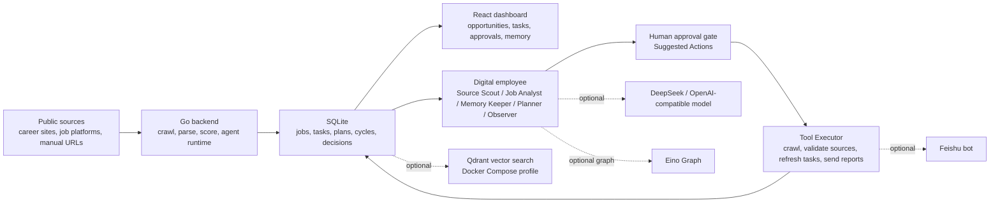

# Job Hunter Agent


[中文文档](README.zh-CN.md) | [Project Home](README.md)

Job Hunter Agent is a local-first recruiting digital employee for campus recruitment and early-career job hunting. It discovers recruiting sources, collects jobs, filters low-quality content, scores opportunities, generates daily work queues, and sends actionable summaries through a web dashboard and Feishu bot.

The project currently focuses on technical roles such as frontend, backend, Java, Go, algorithms, and AI application development, with Shenzhen as the default city profile. It is not just a crawler collection; it is evolving into a configurable and auditable recruiting Agent with optional model and Eino Graph orchestration.

## Status

The project is in an early productization phase and already provides a local end-to-end loop:

- Go backend, React frontend, and SQLite persistence.
- Job crawling, source discovery, source validation, deduplication, filtering, and scoring.
- Candidate profile, job details, application Kanban, and daily task queue.
- Digital employee sidebar, global chat, command center, and suggested-action approval queue.
- Agent Tool Registry with tool descriptions, risk levels, approval requirements, and execution previews.
- Optional DeepSeek/OpenAI-compatible model mode with local-rule fallback.
- Multi-agent runtime: Source Scout, Job Analyst, Memory Keeper, Planner, Tool Planner, and Observer.
- Optional Eino Graph orchestration path with deterministic fallback by default.
- Feishu test notifications, crawl summaries, duty reports, and Agent Cycle summaries.
- Docker Compose for local deployment; frontend can be deployed separately as static assets.

## Architecture



See the full architecture guide: [docs/architecture.md](docs/architecture.md)

## Core Capabilities

### 1. Recruiting Data Collection

- Manual URL import and scheduled crawling.
- Default crawl schedule: 09:00, 12:00, and 18:00.
- Automatic discovery of company career sites, community entrances, and job-platform search pages.
- Source validation for recruiting signals and discovered job links.
- Persistent SQLite storage for collected jobs.

### 2. Filtering and Scoring

- Scores jobs by city, role direction, company signals, campus recruitment signals, and application links.
- Filters obvious outsourcing, training/course-sales content, unclear-conversion internships, and unrelated roles.
- Deduplicates by application URL and normalized company/title/city.
- Explains fit signals, risks, and suggested next actions in job details.

### 3. Recruiting Workspace

- Dashboard: opportunities, tasks, Agent Cycles, source health, and suggested actions.
- Profile: target cities, directions, skills, education, preferred companies, blocked keywords.
- Applications: preparation plans, resume version notes, draft notes, and follow-up dates.
- Companies: company pool, source discovery, validation, and acceptance.
- Settings: crawl schedule, Feishu webhook, model configuration, duty reports, and task SLA.

### 4. Digital Employee and Agent Loop

- Global digital employee chat with local-rule and model-enhanced replies.
- Chat context includes candidate profile, recent jobs, semantic memory, and recent conversation history.
- Model suggestions are persisted as Suggested Actions and require human approval before execution.
- Approved actions go through a unified Agent Tool Executor and store execution receipts.
- Agent Cycles record multi-agent observations, decisions, and proposed next steps.
- Local semantic memory uses deterministic hash embeddings by default. Personal deployments can optionally enable Qdrant vector search; DeepSeek embeddings and pgvector remain provider extension points.

### 5. Feishu Notifications

- Users can paste their own Feishu incoming bot webhook in Settings.
- Test notifications are supported.
- Crawl summaries can be sent after runs.
- Automatic duty reports can include task queues, source issues, recommended jobs, and the latest Agent Cycle.

## Safety Boundary

- No automatic resume submission.
- No login automation without explicit user approval.
- No captcha, slider, or anti-bot bypass.
- No external action without confirmation.
- Memory must not store secrets.

## Quick Start

Backend requires Go 1.25 or newer:

```bash
cd backend
go run ./cmd/server
```

Frontend requires Node.js and npm:

```bash
cd frontend
npm install
npm run dev
```

Open:

```text
http://localhost:5173
```

Docker Compose:

```bash
docker compose up --build
```

Optional Qdrant semantic memory:

```powershell
$env:SEMANTIC_MEMORY_PROVIDER="qdrant"
$env:QDRANT_URL="http://qdrant:6333"
docker compose --profile qdrant up --build
```

## Environment

```env
APP_ADDR=:8080
APP_DB_PATH=data/job-hunter-agent.db
FEISHU_WEBHOOK_URL=
DISABLE_SCHEDULER=0
SOURCE_URLS=
AGENT_ORCHESTRATOR=deterministic
SEMANTIC_MEMORY_PROVIDER=local_hash
QDRANT_URL=
QDRANT_COLLECTION=job_hunter_memory
QDRANT_API_KEY=
LLM_PROVIDER=
LLM_API_KEY=
LLM_BASE_URL=https://api.openai.com/v1
LLM_MODEL=
DEEPSEEK_API_KEY=
DEEPSEEK_MODEL=deepseek-chat
```

Common settings:

- `SOURCE_URLS`: comma-separated or newline-separated public recruiting URLs.
- `FEISHU_WEBHOOK_URL`: Feishu incoming bot webhook. Dashboard Settings take priority.
- `AGENT_ORCHESTRATOR`: defaults to `deterministic`; optional value: `eino_graph`.
- `SEMANTIC_MEMORY_PROVIDER`: defaults to `local_hash`; set it to `qdrant` with `QDRANT_URL` to sync semantic memory into Qdrant and prefer Qdrant similarity search. `deepseek_embedding` and `pgvector` remain provider extension points.
- `QDRANT_URL`: optional Qdrant endpoint, for example `http://localhost:6333`.
- `QDRANT_COLLECTION`: Qdrant collection name, defaults to `job_hunter_memory`.
- `QDRANT_API_KEY`: optional Qdrant API key.
- `LLM_PROVIDER`: `deepseek` or another OpenAI-compatible provider.
- `LLM_API_KEY` / `DEEPSEEK_API_KEY`: model keys. Without them, local-rule replies are used.

DeepSeek example:

```env
LLM_PROVIDER=deepseek
DEEPSEEK_API_KEY=your_key
DEEPSEEK_MODEL=deepseek-chat
```

## Optional Eino Graph

```powershell
.\scripts\run-eino.ps1
```

Verification:

```powershell
go test -tags eino ./internal/jobs -run TestEinoRecruitingOrchestratorRunsGraph
```

Without the `eino` build tag, `AGENT_ORCHESTRATOR=eino_graph` safely falls back to deterministic orchestration.

The resume-facing proof checklist is kept in [docs/resume-proof.md](docs/resume-proof.md).

## First Run Checklist

1. Open `http://localhost:5173`.
2. Go to Settings and configure target cities, directions, blocked keywords, and crawl schedule.
3. Paste your Feishu webhook and send a test notification if needed.
4. Go to Companies, seed the recommended company pool, and run Discover Sources.
5. Validate and accept useful source candidates.
6. Return to Dashboard and run a crawl.
7. Review Opportunities and mark jobs as Interested, Applied, or Ignore.
8. Fill in your Profile.
9. Maintain application plans in Applications.
10. Review Daily Tasks, Suggested Actions, and Agent Cycles.
11. Ask the digital employee questions such as “Which jobs are most worth applying to today?” or “Why does this role fit me?”.

## Useful Commands

```bash
cd backend
go test ./...
go test -tags eino ./internal/jobs -run TestEinoRecruitingOrchestratorRunsGraph
```

```bash
cd frontend
npm run build
```

## Project Structure

```text
.
+-- backend
|   +-- cmd/server              # Backend entrypoint
|   +-- internal/app            # Application wiring and automation
|   +-- internal/config         # Environment configuration
|   +-- internal/crawl          # Crawl runner and scheduler
|   +-- internal/db             # SQLite schema and connection
|   +-- internal/domain         # Shared domain types
|   +-- internal/http           # REST APIs and tool executor
|   +-- internal/jobs           # Jobs, scoring, agent runtime, memory, tool registry
|   +-- internal/notify         # Feishu webhook notification
+-- frontend
    +-- src                     # React dashboard
```

## Local Data

Default SQLite path:

```text
backend/data/job-hunter-agent.db
```

Local databases, logs, build outputs, private planning docs, and environment files are ignored by Git.

## Deployment Notes

- Frontend: deployable as static assets after `npm run build`.
- Backend: requires a long-running Go process and persistent storage.
- Scheduler: automatic crawls, source discovery, task SLA, and Feishu duty reports require an always-on backend.
- SQLite: good for local-first usage. For hosted multi-user usage, plan a Postgres migration.
- Vercel: suitable for the frontend, not enough for the full current product by itself.

More setup notes: [docs/open-source-setup.md](docs/open-source-setup.md).

v1.0 goal and definition of done: [docs/v1.0-goal.md](docs/v1.0-goal.md).

Product-agent roadmap: [docs/product-agent-roadmap.zh-CN.md](docs/product-agent-roadmap.zh-CN.md).

## Roadmap

- Improve company-specific and job-platform parsers.
- Expand the default company pool and source discovery strategy.
- Upgrade model chat into structured tool-calling planning.
- Move Eino Graph from optional adapter to a fuller multi-agent orchestration path.
- Add replaceable vector database or external embedding providers.
- Add resume-version templates, application draft generation, and richer follow-up reminders.
- Explore Feishu Base, spreadsheet, or other external system sync.

## Contributing

Issues and pull requests are welcome. Please avoid adding automatic login, anti-bot bypass, or unconfirmed automatic application submission.

## Third-Party Assets

- `frontend/public/assets/noto-cat-face.svg` is from Google Noto Emoji and is used for the digital employee cat avatar. See `frontend/public/assets/NotoEmoji-LICENSE.txt` for the upstream license.

## License

MIT
