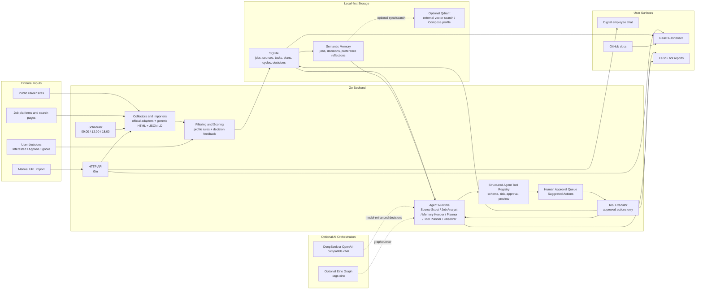
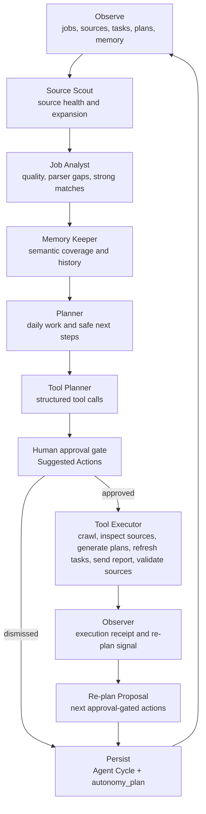
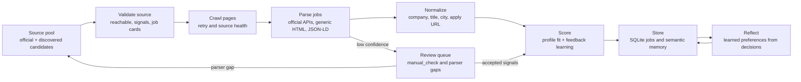
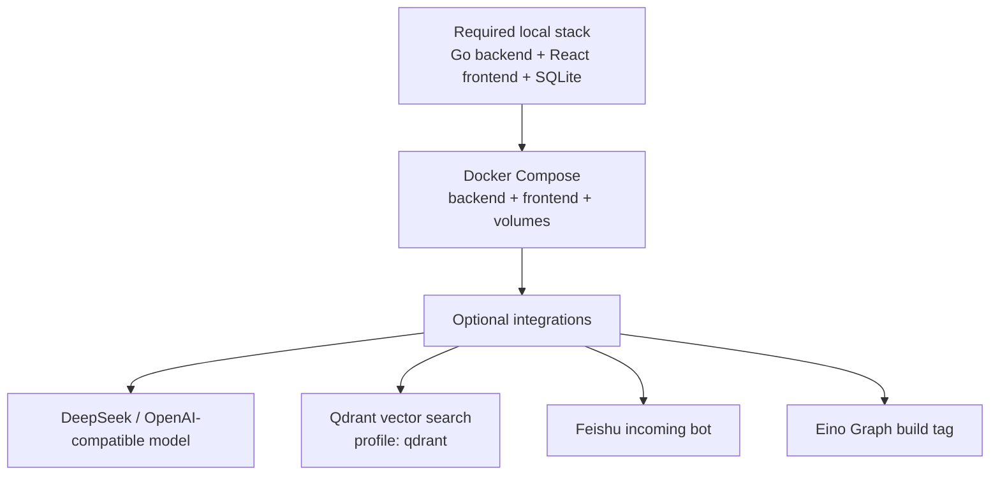

# Architecture

This project is a personal-first recruiting digital employee. The core design keeps local ownership of data while letting the agent use optional model, Eino Graph, Qdrant, and Feishu integrations when the user configures them.

## System View

## Agent Loop

## Data Quality Pipeline

## Personal Deployment Boundary

## Key Boundaries

- Local SQLite remains the source of truth for personal use.
- External integrations are opt-in and can fail without blocking local operation.
- Model output never executes directly; it becomes an approval-gated action.
- No automatic resume submission, third-party login automation, captcha bypass, or secret storage in semantic memory.
