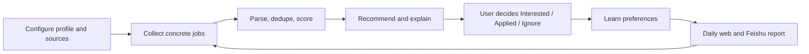

# Job Hunter Agent v1.0 Goal

Job Hunter Agent v1.0 is a personal recruiting digital employee, not a generic job board.

Its job is to run every day, collect concrete recruiting opportunities, explain what is worth reviewing, remember the user's decisions, and send a daily work report so the user only needs to make decisions.

## Definition of Done

v1.0 is complete when a personal user can do the following without editing code:

1. Configure target cities, directions, skills, blocked keywords, source preferences, Feishu, and a DeepSeek/OpenAI-compatible model.
2. Seed or discover sources, then run a crawl that stores concrete jobs instead of only career landing pages.
3. Review jobs with company, title, city, direction, apply link, source, score, reasons, and warnings.
4. Mark jobs as Interested, Applied, or Ignore and see those decisions affect future recommendations.
5. Ask the digital employee what to review today and receive answers grounded in jobs, semantic memory, and learned preferences.
6. Receive a daily duty report with recommended jobs, open tasks, source issues, parser gaps, and the next best action.
7. Run locally with Docker Compose or normal Go/Node commands with persistent SQLite data.
8. Understand setup, backups, model configuration, and long-running scheduler requirements from open-source docs.

## Explicit Non-goals

- No enterprise multi-tenant SaaS for v1.0.
- No automatic resume submission before user approval.
- No third-party login automation, captcha bypass, or scraping behind authentication.
- No attempt to cover every recruiting platform.
- No further mascot work unless it directly improves the recruiting workflow.

## Product Loop

## Remaining v1.0 Work Must Fit One Track

- Data quality: more concrete jobs, fewer landing pages, better parser gaps.
- Agent quality: grounded answers, better daily plans, safer action approval.
- Personal setup: less README hunting, clearer first-run checklist.
- Reliability: persistent data, observable failures, backup and restore path.
- Open-source usability: understandable docs and zero-secret defaults.
